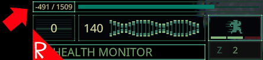

# Quasimorph ShowHunger

# Beta Only
This is currently only for the opt in beta, and not the current release.

# Docs

This mod adds a negative "hunger" number to the left of the normal food number.
This number indicates how many food points are required to return to 100%.

Since different mercs have different max calories, this makes it easier for the player to decide if they want to eat the 300 point candy bar or the 450 point meal.

# Support
If you enjoy my mods and want to buy me a coffee, check out my [Ko-Fi](https://ko-fi.com/nbkredspy71915) page.
Thanks!

# Source Code
Source code is available on GitHub at https://github.com/NBKRedSpy/QM_ShowHunger
